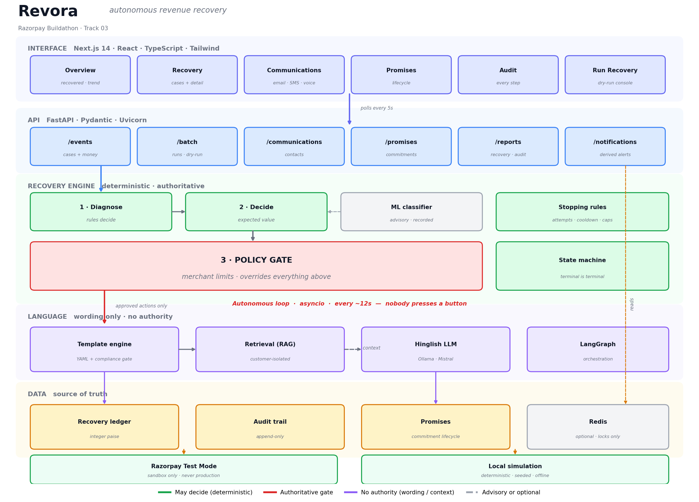

# Revora — Architecture

Every component described here exists in this repository. Where something is
deliberately **not** built, it says so.



> Regenerate with `python3 docs/make_architecture.py`. The diagram is kept as a
> script rather than an exported image so it can be corrected when the system
> changes, instead of quietly going stale.

---

## 1. How to read the diagram

Everything flows **downward through the policy gate**. Nothing reaches a customer
without passing it, and nothing below it can appeal its verdict.

Colour carries meaning:

| Colour | Meaning |
|---|---|
| 🟩 Green | May decide. Deterministic and auditable. |
| 🟥 Red | The authoritative gate. Overrides everything above it. |
| 🟪 Purple | No authority. Wording and context only. |
| ⬜ Grey dashed | Advisory or optional. The system runs correctly without it. |

---

## 2. The recovery loop

```
payment event
   → diagnose         rules decide the root cause; a classifier offers a
                      second opinion that is recorded and never obeyed
   → decide           every permitted action scored by expected value:
                      P(recovery) × amount − cost − customer annoyance,
                      tilted by what is known about this payer
   → POLICY GATE      attempt limits · cooldowns · contact caps ·
                      amount thresholds · do-not-contact · open promises
   → compose          template engine builds the message, then the
                      compliance gate judges it
   → rewrite          approved copy becomes natural Hinglish; output
                      re-validated; template used on any doubt
   → reach            email, SMS or call, chosen by the agent
   → respond          simulated reply, read deterministically
   → promise          a stated date becomes a tracked commitment;
                      recovery pauses until it passes
   → verify           did the money actually arrive?
   → ledger + audit   recorded once, in one place
```

---

## 3. Component reference

### Recovery engine — authoritative

| Module | Purpose | Technology |
|---|---|---|
| `engine/diagnosis_engine.py` | Root cause from gateway codes and event shape | Rules |
| `ml/diagnosis_classifier.py` | Independent second opinion, **recorded, never obeyed** | scikit-learn |
| `engine/probability_engine.py` | Expected-value ranking, tilted by customer history | Deterministic |
| `engine/decision_engine.py` | Orchestrates diagnosis → scoring → gate | Python |
| `engine/policy_engine.py` | **Merchant limits. Overrides everything.** | Rules |
| `engine/state_machine.py` | Legal transitions; terminal states stay terminal | Enum FSM |
| `engine/promise_tracker.py` | Promise lifecycle and reply interpretation | Deterministic |

### Language — no authority

| Module | Purpose | Technology |
|---|---|---|
| `engine/template_engine.py` | Builds the script; runs the compliance gate | YAML |
| `templates/compliance_rules.yaml` | Contact hours, frequency, urgency, language | YAML |
| `engine/retrieval.py` | Customer-isolated history, for tone | SQLite |
| `services/hinglish_llm.py` | Rewrites approved copy | Ollama · Mistral |

### Infrastructure

| Module | Purpose | Technology |
|---|---|---|
| `engine/recovery_graph.py` | Expresses workflow shape and branches | LangGraph |
| `infra/redis_client.py` | Distributed locks, idempotency pre-check | Redis (optional) |
| `gateways/razorpay_test.py` | Sandbox payments | Razorpay SDK |
| `gateways/local_simulation.py` | Deterministic, seeded, offline | SHA-256 |

---

## 4. Design decisions, and why

### Why the ML model has no authority
A misclassified root cause would send the wrong recovery action to a real customer and
charge a real card. The rules are auditable and explainable; the model is not. So the
classifier runs, its opinion is recorded beside the rule verdict, and **disagreement is
surfaced for human review rather than resolved in the model's favour.**

### Why compliance is a gate, not a warning
A refused message that still carried its text could be copied out and sent anyway — and
eventually would be. A blocked message therefore has an empty body. There is nothing to
override.

### Why money is integer paise
Floating-point rupees drift. `0.1 + 0.2 != 0.3` is amusing in a REPL and unacceptable in a
ledger. Money is stored as integer paise, serialised as exact decimal strings, and a test
asserts the partition balances to the paisa.

### Why retrieval is SQLite, not a vector database
The question being asked is *"what happened with this customer, most recently"* — a
filtered, ordered read that SQLite answers **exactly**. Embeddings would add an index to
maintain, a model to run and a threshold to tune in order to **approximate** an answer the
database already gives precisely. The retriever sits behind a small interface, so a
vector implementation can replace it without touching callers.

### Why LangGraph orchestrates but does not decide
The recovery sequence already existed as control flow; LangGraph makes its shape
inspectable. Every node delegates to the engine that owns that step, and the graph writes
nothing. A node that let a model choose an action would make this an agent — which is
exactly what a system handling other people's money should not be.

`langchain-core` arrives as a LangGraph dependency. No LangChain chain, agent or tool
abstraction is used, and a test enforces that.

### Why Redis is optional
Redis prevents *duplicated effort*; the database prevents *duplicate recovery*. Since
correctness never rested on Redis, an unavailable Redis is treated as a granted lock — the
work proceeds and the database catches any duplicate. Failing closed would turn a cache
outage into a total recovery outage.

### Why a promised date is never guessed
"I will pay soon" carries intent but no date. Inventing one would create a commitment the
customer never made, and Revora would then **pause recovery on the strength of a fiction**.
Intent is recorded, the date stays null, and no promise is created.

### Why each autonomous pass uses its own seed
The generator is deterministic: the same seed returns the same cases. A fixed seed made
the loop regenerate one identical case every twelve seconds and store each as new. Seeds
now derive from the pass number — reproducible, but genuinely different work each pass.

---

## 5. Data model

`OUTCOME` is the recovery ledger and the single source of financial truth. One function
writes to it.

```
RISK_EVENT ──1:1── DIAGNOSIS              CUSTOMER_PROFILE ──1:N── RISK_EVENT
     │                                    MERCHANT ──1:N── POLICY
     ├──1:N── DECISION
     ├──1:N── PAYMENT_ATTEMPT
     ├──1:1── OUTCOME                 ← the ledger. integer paise.
     ├──1:N── COMMUNICATION_LOG ──0:1── PROMISE_TO_PAY
     ├──1:N── AUDIT_LOG               ← append-only
     └──1:1── STOPPING_RULE_STATE
```

---

## 6. Safety boundaries

| ✅ May decide | ❌ May never decide |
|---|---|
| Rule diagnosis | ML classifier |
| Probability scoring | Retrieval / RAG |
| Policy engine | LangGraph |
| Stopping rules | Hinglish LLM |
| State machine | Customer replies |

A customer reply is **data, never an instruction**. Retrieved text is sanitised, labelled
as quoted background, and reaches only the wording layer — which has no power to act on it.

---

## 7. Deliberately not built

Honesty matters more than a longer list.

| Not built | Why |
|---|---|
| pgvector / vector search | SQLite answers the actual query exactly (§4) |
| Real email/SMS/voice delivery | No provider is wired in, so nothing may claim a send |
| Production authentication | Not needed for the demo; enterprise auth is attack surface bought with no benefit |
| Multi-agent orchestration | One deterministic pipeline is the correct shape for money |
| A PDF service | Reports are computed from the same ledger rows the dashboard reads |

## 8. Known limitations

- **Subscription recoveries need a day.** The provider's auto-retry window is 24 hours, so
  a short demo shows them as still in progress. That is honest, not broken — a verification
  sweep settles them once the window passes.
- **Redis is not yet wired into the batch.** The primitives are built and tested; the loop
  is single-process, so there is nothing to coordinate.
- **Reports have no frontend.** The endpoints exist and are tested.
